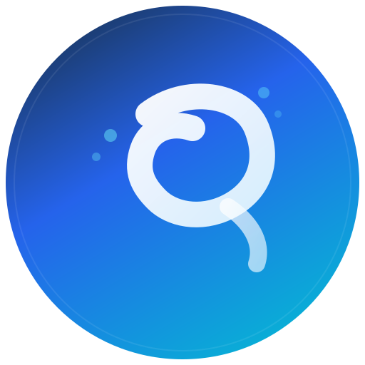

<div align="center">
  
  <h1>SquidCloud</h1>
  <p><strong>Secure, Unlimited Cloud Storage Platform — <em>v12.0.18</em></strong></p>

  [](https://squidcloud.vercel.app)
  [](https://opensource.org/licenses/MIT)
  [](https://www.typescriptlang.org/)
  [](https://reactjs.org/)
  [](https://squidcloud.vercel.app)
</div>

<br />

> **SquidCloud** is a next-generation, privacy-first cloud storage solution powered by the **Res54 Distributed Architecture**. Uncapped storage capacity, military-grade end-to-end encryption, and high-performance delivery — all seamlessly integrated into a modern web, desktop, and mobile ecosystem.

---

## Latest Version

| Component | Version | Status |
|---|---|---|
| Web Platform | 12.0.18 | ✅ Live |
| Android APK | 11.1.0 | ✅ Available |
| SquidLab SDK | 1.1.0 | ✅ Stable |

Current release: **v12.0.18** — [squidcloud.vercel.app](https://squidcloud.vercel.app)

---

## Table of Contents

- [What is SquidCloud?](#what-is-squidcloud)
- [Key Features](#key-features)
- [Storage Options](#storage-options)
- [How It Works](#how-it-works)
- [Architecture](#architecture)
- [Security](#security)
- [Getting Started](#getting-started)
- [Mobile & Desktop](#mobile--desktop)
- [Legal](#legal)

---

## What is SquidCloud?

SquidCloud is a next-generation cloud storage platform that combines the convenience of traditional cloud storage with advanced security features and unlimited capacity. Unlike conventional cloud providers, SquidCloud uses a unique distributed storage system called **Res54** that fragments, encrypts, and distributes your files across multiple secure repositories.

SquidCloud offers a free tier, is independently operated, and built with a privacy-first philosophy. We do not sell your data, run ads, or train AI on your files.

---

## Key Features

### Smart Ingestion

**Remote URL Upload**
Fetch any file directly from a public shareable link. The server handles the download stream, bypassing browser CORS restrictions, with a unified real-time progress indicator. Paste a URL into the upload dialog and the file lands in your workspace — no intermediate downloads, no copy-paste.

### Instant Preview & Reading

**DeepRead Reader**
Open any document in an immersive, distraction-free reading mode. DeepRead renders text content with adjustable typography, clean layout, and zero chrome — designed for focused consumption of long documents, notes, and exported content.

### Developer Tooling

**API Keys & Usage Analytics**
Generate scoped API keys directly from the dashboard. Each key is bound to your account with granular permissions. Access a built-in analytics panel showing request volumes, latency distributions, and usage trends over the last 90 days — all without leaving the platform.

### Sharing & Publishing

**Publish as Website**
Turn any folder in your workspace into a live, publicly accessible static website with one click. HTTPS, caching, and CDN delivery are handled automatically. Ideal for documentation, landing pages, and personal sites — your content, your infrastructure.

### Encryption & Zero-Knowledge

**Bring Your Own Key (BYOK)**
Supply your own encryption key. All encryption and decryption happens client-side. SquidCloud is cryptographically incapable of reading your data in BYOK mode. Your key is never transmitted to or stored on our servers.

### AI & Productivity

**SquidAI Assistant**
An integrated AI assistant for workspace tasks — file search, content summarization, and smart suggestions. Accessible from anywhere in the dashboard without leaving your current context.

**Keyboard-First Navigation**
A comprehensive shortcut map and command palette (⌘K) for power users. Navigate, search, and perform actions at full speed without reaching for the mouse.

**Bookmarks & Favorites**
Pin important files with color tags and quick-access bookmarks. Build a personalized workspace view that surfaces what matters most.

---

## Storage Options

SquidCloud gives you full control over where your data lives.

### SquidCloud Storage (Default)
Your files are chunked, encrypted with AES-256-GCM, serialized as opaque blobs, and stored on Backblaze B2 object storage via SquidCloud's distributed cluster. The stored blobs reveal nothing — no filename, file type, or content can be identified from them by any party. Only your account with the correct decryption credentials can reassemble and decrypt the original files.

**Best for:** Zero-configuration setup with no external accounts required.

### Bring Your Own Storage (BYOS)
Connect your own external storage provider. SquidCloud acts as your interface — your files go directly to your infrastructure, not ours. Any S3-compatible provider works, including AWS S3, Cloudflare R2, Wasabi, Backblaze B2, Google Cloud Storage, Azure Blob Storage, and more.

**Best for:** Users who want full infrastructure ownership, compliance control, or are already paying for cloud storage.

### Bring Your Own Key (BYOK)
Supply your own encryption key for complete zero-knowledge encryption. Your key is never transmitted to or stored by SquidCloud.

> If you lose your BYOK encryption key, SquidCloud cannot recover your data. Keep a secure independent backup of your key at all times.

**Best for:** Users with strict security requirements, developers, and enterprise use cases.

---

## How It Works

```
Your File
    │
    ▼
Client-side chunking
    │
    ▼
AES-256-GCM Encryption (Res54 Engine)
    │
    ▼
Serialized as opaque blobs
    │
    ├──► SquidCloud Storage: Backblaze B2 (default)
    ├──► BYOS: Your S3-compatible bucket (AWS, R2, Wasabi, GCP, etc.)
    └──► BYOK: Encrypted with your own key before any of the above
```

Metadata (filename, size, type, timestamps) is stored separately in Supabase. File content and metadata are never stored together.

---

## Architecture

| Layer | Technology |
|---|---|
| Frontend | React 18 + TypeScript + Vite |
| UI | Shadcn/ui + Tailwind CSS |
| Backend / Auth | Supabase |
| Native Storage | Backblaze B2 via SquidCloud cluster |
| External Storage | Any S3-compatible provider (AWS, R2, Wasabi, GCP, Azure, etc.) (BYOS) |
| Encryption | Res54 (AES-256-GCM, fixed-size chunking, optional entropy) |
| Hosting | Vercel |
| Android | Capacitor + signed APK via GitHub Actions |
| SDK | SquidLab SDK v1.1.0 |

---

## Security

| Feature | Status |
|---|---|
| AES-256-GCM Encryption | ✅ Enabled |
| Client-side Encryption | ✅ Before upload |
| BYOK (Zero-knowledge) | ✅ Available |
| HTTPS Enforced | ✅ Global |
| Passkey / WebAuthn | ✅ Supported |
| PIN Authorization | ✅ On share and delete |
| OAuth PKCE Flow | ✅ Mobile hardened |
| No plaintext storage | ✅ Guaranteed |
| No AI training on files | ✅ Never |
| No data selling | ✅ Never |

We do not access, read, or analyze your file content under any circumstance. In BYOK mode, we are cryptographically incapable of doing so.

---

## Getting Started

### Web
Visit [squidcloud.vercel.app](https://squidcloud.vercel.app) and create a free account.

### Android
Download the latest signed APK from the releases section of this repository. Requires Android 7.0 or later.

### API
Generate an API key from your dashboard. Every key is scoped to your account and logged for security purposes.

Full API documentation is available in your dashboard after signing in.

### CLI
The SquidCloud CLI supports automation and scripting via your API key. See the CLI documentation in your dashboard for setup instructions.

---

## Mobile & Desktop

| Platform | Version | Status |
|---|---|---|
| Web (PWA) | 12.0.18 | ✅ Live |
| Android (APK) | 11.1.0 | ✅ Available |
| iOS | — | Planned |
| Desktop (Electron) | — | Planned |

The Android app is built with Capacitor and distributed as a signed APK. It supports full feature parity with the web platform including BYOS, BYOK, file upload with background worker, and OAuth sign-in.

---

## Legal

SquidCloud is an independent project operated by its founders. A free tier is available with optional paid upgrades.

- [Privacy Policy](https://squidcloud.vercel.app/privacy)
- [Terms of Service](https://squidcloud.vercel.app/terms)

Governed by the laws of India. Compliant with the Digital Personal Data Protection Act, 2023 (DPDP Act).

For support or legal inquiries: **hellosquidcloud@gmail.com**

---

## SquidLab SDK

Build extensions on top of SquidCloud with the SquidLab SDK (v1.1.0). The SDK provides a CLI, TypeScript/JavaScript libraries, pre-built React components, and a sandboxed extension format (.sqe) for building integrations.

See the SDK repository for full documentation and examples.

---

<div align="center">
  <p>Built and maintained with care by Lamgerr</p>
  <p>
    <a href="https://squidcloud.vercel.app">Platform</a> ·
    <a href="https://squidcloud.vercel.app/privacy">Privacy</a> ·
    <a href="https://squidcloud.vercel.app/terms">Terms</a> ·
    <a href="mailto:hellosquidcloud@gmail.com">Contact</a>
  </p>
  <p><i>SquidCloud v12.0.18</i></p>
</div>
